# Changeset Capture & Notification Architecture

---

## System Overview

```mermaid
flowchart TD
    subgraph INGESTION["① SFTP Ingestion Layer"]
        SFTP["External SFTP Server\n(data + audit files)"]
        POLL["EventBridge Scheduler\n(cron-based poll)"]
        SFTP_LAMBDA["Lambda: SFTP Puller\n(SSH/SFTP client)"]
        S3_LANDING["S3: Landing Zone\ns3://bucket/landing/{date}/{batchId}/\n  ├── data_{type}_{batchId}.txt\n  └── audit_{type}_{batchId}.txt"]
    end

    subgraph ORCHESTRATION["② Orchestration Layer"]
        EB_RULE["EventBridge Rule\n(S3 PutObject → trigger on audit file)"]
        SFN["Step Functions\n(reuse existing)"]
    end

    subgraph PROCESSING["③ EMR Processing Layer (reused + extended)"]
        SFN_VALIDATE["State: Validate Pair\n(check both files present)"]
        SFN_EMR_CREATE["State: Create EMR Cluster"]
        SFN_SPARK["EMR Spark Job\nChangeset Processor"]
        SFN_EMR_TERM["State: Terminate EMR"]
        S3_PROCESSED["S3: Processed Zone\ns3://bucket/changesets/{entityType}/{date}/{batchId}/\n  ├── manifest.json\n  ├── inserts/\n  ├── updates/\n  └── deletes/"]
        SFN_MAP["State: Optional\nMapping / Enrichment\n(reused existing step)"]
    end

    subgraph PUBLISHING["④ Event Publishing Layer (new)"]
        SFN_PUBLISH["State: Publish Changesets\n(Lambda)"]
        SNS["SNS Topic\narn:aws:sns:...:entity-changesets\n\nAttributes:\n• changeType: INSERT|UPDATE|DELETE\n• entityType: string\n• batchId: string"]
        DLQ_SNS["SQS Dead Letter Queue\n(failed publish)"]
    end

    subgraph CONSUMERS["⑤ Downstream Consumers"]
        direction TB
        SQS_A["SQS Queue A\nMicroservice Consumer\n(filter: all changeTypes)"]
        SQS_B["SQS Queue B\nSearch Index Consumer\n(filter: INSERT, UPDATE)"]
        SQS_C["SQS Queue C\nAudit Store Consumer\n(filter: all changeTypes)"]
        SQS_D["SQS Queue D\nAnalytics Consumer\n(no filter — batch)"]

        LAMBDA_A["Lambda: Microservice Handler"]
        LAMBDA_B["Lambda: OpenSearch Indexer"]
        LAMBDA_C["Lambda: Audit Writer\n→ DynamoDB / S3 Glacier"]
        LAMBDA_D["Lambda / Glue: Analytics Loader\n→ Redshift / S3 Data Lake"]

        S3_PROCESSED_READ["S3 Processed Zone\n(consumers fetch full\npayload from S3 pointer)"]
    end

    %% Ingestion flow
    SFTP --> POLL
    POLL --> SFTP_LAMBDA
    SFTP_LAMBDA -->|"PUT both files atomically"| S3_LANDING

    %% Trigger
    S3_LANDING -->|"S3 Event on audit file\n(pair completeness signal)"| EB_RULE
    EB_RULE --> SFN

    %% Step Function states
    SFN --> SFN_VALIDATE
    SFN_VALIDATE -->|"pair valid"| SFN_EMR_CREATE
    SFN_VALIDATE -->|"missing file"| ALERT["CloudWatch Alarm\n+ SNS Alert"]
    SFN_EMR_CREATE --> SFN_MAP
    SFN_MAP --> SFN_SPARK
    SFN_SPARK -->|"write changesets"| S3_PROCESSED
    SFN_SPARK --> SFN_EMR_TERM
    SFN_EMR_TERM --> SFN_PUBLISH

    %% Publishing
    SFN_PUBLISH -->|"read manifest.json"| S3_PROCESSED
    SFN_PUBLISH --> SNS
    SFN_PUBLISH -.->|"on failure"| DLQ_SNS

    %% SNS fanout
    SNS -->|"filter: changeType=*"| SQS_A
    SNS -->|"filter: changeType IN [INSERT,UPDATE]"| SQS_B
    SNS -->|"filter: changeType=*"| SQS_C
    SNS -->|"filter: changeType=*"| SQS_D

    SQS_A --> LAMBDA_A
    SQS_B --> LAMBDA_B
    SQS_C --> LAMBDA_C
    SQS_D --> LAMBDA_D

    LAMBDA_A -.->|"fetch full payload"| S3_PROCESSED_READ
    LAMBDA_B -.->|"fetch delta"| S3_PROCESSED_READ
    LAMBDA_D -.->|"batch read"| S3_PROCESSED_READ
```



---

## Input File Formats

### Data File (`data_{changeType}_{batchId}.txt`)
One JSON object per line. Contains **only changed field values** for UPDATE type;
full record for INSERT; entity ID only for DELETE.

```jsonl
{"entityId":"ENT-001","firstName":"Jane","email":"jane@new.com"}
{"entityId":"ENT-002","status":"ACTIVE","tier":"GOLD"}
{"entityId":"ENT-003","phone":"+15550001234"}
```

### Audit File (`audit_{changeType}_{batchId}.txt`)
One JSON object per line. Contains **full row** with `1` (changed) / `0` (unchanged).

```jsonl
{"entityId":"ENT-001","firstName":1,"lastName":0,"email":1,"phone":0,"status":0,"tier":0,"address":0}
{"entityId":"ENT-002","firstName":0,"lastName":0,"email":0,"phone":0,"status":1,"tier":1,"address":0}
{"entityId":"ENT-003","firstName":0,"lastName":0,"email":0,"phone":1,"status":0,"tier":0,"address":0}
```

### File Naming Convention
```
data_{INSERT|UPDATE|DELETE}_{batchId}_{YYYYMMDD}.txt
audit_{INSERT|UPDATE|DELETE}_{batchId}_{YYYYMMDD}.txt
```

---

## EMR Spark Job: Changeset Processing Logic

```
1. Read data file  (JSON lines)    → dataDF
2. Read audit file (JSON lines)    → auditDF
3. JOIN dataDF + auditDF ON entityId
4. For each row:
   - changedFields = [col for col in auditDF if value == 1]
   - deltaPayload  = {col: dataDF[col] for col in changedFields}
   - fullAuditRow  = auditDF row
5. Write per changeType partition to S3 processed zone (JSON or Parquet)
6. Write manifest.json with:
   - batchId, entityType, changeType counts, S3 paths, record counts
```

---

## SNS Event Contract

### SNS Message Attributes (for filter policies)

| Attribute    | Type   | Values                        | Description                      |
|-------------|--------|-------------------------------|----------------------------------|
| changeType  | String | `INSERT`, `UPDATE`, `DELETE`  | Type of change                   |
| entityType  | String | e.g. `Customer`, `Order`      | Domain entity type               |
| batchId     | String | UUID                          | Groups all events from one file drop |
| eventVersion| String | `1.0`                         | Schema version for evolution     |

---

### SNS Payload Schema (Recommended: Option A — Metadata + S3 Pointer)

> **Why this option?** SNS limit is 256KB. Individual entity changesets across a 300MB
> file can be large. S3 pointer keeps messages tiny (~1KB), cost-efficient, and lets
> consumers fetch only what they need.

```json
{
  "eventId": "uuid-v4",
  "eventVersion": "1.0",
  "eventType": "ENTITY_CHANGESET",
  "changeType": "UPDATE",
  "entityType": "Customer",
  "entityId": "ENT-001",
  "batchId": "batch-20240315-abc123",
  "occurredAt": "2024-03-15T10:32:00Z",
  "processedAt": "2024-03-15T10:45:22Z",

  "changeset": {
    "changedFields": ["firstName", "email"],
    "deltaRef": "s3://bucket/changesets/Customer/2024-03-15/batch-abc123/updates/ENT-001_delta.json",
    "fullAuditRef": "s3://bucket/changesets/Customer/2024-03-15/batch-abc123/updates/ENT-001_audit.json"
  },

  "source": {
    "dataFile": "s3://bucket/landing/2024-03-15/batch-abc123/data_UPDATE_batch-abc123_20240315.txt",
    "auditFile": "s3://bucket/landing/2024-03-15/batch-abc123/audit_UPDATE_batch-abc123_20240315.txt"
  },

  "processing": {
    "emrJobId": "j-XXXXXXXXXX",
    "stepFunctionExecutionId": "arn:aws:states:..."
  }
}
```

---

### Payload Options Comparison

| Option | Description | SNS Msg Size | Cost | Latency | Best For |
|--------|-------------|-------------|------|---------|----------|
| **A (Recommended)** | Metadata + S3 pointer | ~1KB | Low | Consumer fetches from S3 | Most consumers; large payloads |
| **B** | Inline delta (changed fields only) | Up to 256KB | Medium | Instant | Microservices needing zero-fetch latency; small entities |
| **C** | Batch manifest | 1 message per batch | Lowest | Batch consumers wait | Analytics / data warehouse |

**Recommended strategy: A + C hybrid**
- Per-entity events (Option A) → real-time consumers via SNS → SQS
- Batch manifest event (Option C) → analytics consumers that process the whole file

---

## Step Function Extension (new states highlighted)

```
[EXISTING]                              [NEW / EXTENDED]
─────────────────────────────────────   ─────────────────────────────
Start                                   ValidatePair ──────────────────────────┐
  │                                       (check data+audit both present)      │
  ▼                                       (check naming convention)            │ FAIL
CreateEMRCluster                          (check file size within bounds)  → AlertOps
  │                                     ─────────────────────────────────────
  ▼
OptionalMappingStep (reused)            ExtendedSparkStep
  │                                       - existing transformations
  ▼                                       - NEW: changeset join + extract
SparkProcessingStep (extended)            - NEW: write to processed zone
  │                                       - NEW: write manifest.json
  ▼                                     ─────────────────────────────────────
TerminateEMRCluster
  │
  ▼  [NEW STATE]
PublishChangesets (Lambda)
  - read manifest.json
  - for each entity in manifest:
      publish to SNS (batch of 10 via SNS BatchPublish)
  - emit batch-complete event
  │
  ▼
End
```

---

## S3 Directory Structure

```
s3://your-bucket/
├── landing/
│   └── {YYYY-MM-DD}/
│       └── {batchId}/
│           ├── data_{INSERT|UPDATE|DELETE}_{batchId}_{date}.txt
│           └── audit_{INSERT|UPDATE|DELETE}_{batchId}_{date}.txt
│
├── changesets/
│   └── {entityType}/
│       └── {YYYY-MM-DD}/
│           └── {batchId}/
│               ├── manifest.json          ← batch summary + record counts + S3 paths
│               ├── inserts/
│               │   └── {entityId}_delta.json
│               ├── updates/
│               │   ├── {entityId}_delta.json
│               │   └── {entityId}_audit.json
│               └── deletes/
│                   └── {entityId}_delta.json
│
└── archive/
    └── {YYYY-MM-DD}/
        └── {batchId}/   ← raw files moved here after processing
```

---

## Manifest File Schema

```json
{
  "batchId": "batch-20240315-abc123",
  "entityType": "Customer",
  "changeType": "UPDATE",
  "processedAt": "2024-03-15T10:45:22Z",
  "sourceDateFile": "s3://...",
  "sourceAuditFile": "s3://...",
  "stats": {
    "totalRecords": 12450,
    "inserts": 200,
    "updates": 12100,
    "deletes": 150
  },
  "paths": {
    "inserts": "s3://bucket/changesets/Customer/2024-03-15/batch-abc123/inserts/",
    "updates": "s3://bucket/changesets/Customer/2024-03-15/batch-abc123/updates/",
    "deletes": "s3://bucket/changesets/Customer/2024-03-15/batch-abc123/deletes/"
  },
  "emrJobId": "j-XXXXXXXXXX"
}
```

---

## Consumer Onboarding Guide

### How to Subscribe
1. Create an SQS queue in your account
2. Request subscription to SNS topic `arn:aws:sns:region:account:entity-changesets`
3. Configure filter policy (optional):

```json
{
  "changeType": ["UPDATE", "INSERT"],
  "entityType": ["Customer"]
}
```

### How to Process an Event
1. Receive SQS message → parse SNS envelope → extract event body
2. Check `changeType` for routing
3. If you need **only changed fields**: fetch `changeset.deltaRef` from S3
4. If you need **audit flags**: fetch `changeset.fullAuditRef` from S3
5. Apply idempotency check using `eventId` (deduplicate retries)
6. Process and acknowledge (delete from SQS)

### Guarantees
- **At-least-once delivery** (SQS standard queue)
- **Ordering**: not guaranteed across entities; use `batchId` + `entityId` for ordering within a batch
- **Replay**: raw files retained in S3 `archive/` for 90 days; changesets in `changesets/` for 30 days
- **Schema evolution**: `eventVersion` field signals breaking changes; consumers should handle unknown fields gracefully

---

## Infrastructure Summary

| Component | Service | Notes |
|-----------|---------|-------|
| SFTP polling | EventBridge Scheduler + Lambda | Cron, pulls files from external SFTP |
| Landing zone | S3 | Raw files, lifecycle → archive after processing |
| Trigger | EventBridge S3 rule | Fires on audit file arrival |
| Orchestration | Step Functions | Reuse existing; add ValidatePair + PublishChangesets states |
| Processing | EMR (Spark) | Reuse existing; extend Spark job |
| Changeset store | S3 | Partitioned by entityType/date/batchId |
| Event bus | SNS | Message attributes enable consumer filter policies |
| Consumer queues | SQS (per consumer) | Each consumer owns their queue + DLQ |
| Observability | CloudWatch + X-Ray | Step Function traces, SNS/SQS metrics |
| Alerting | SNS (ops topic) | File pair validation failures, DLQ depth alarms |
