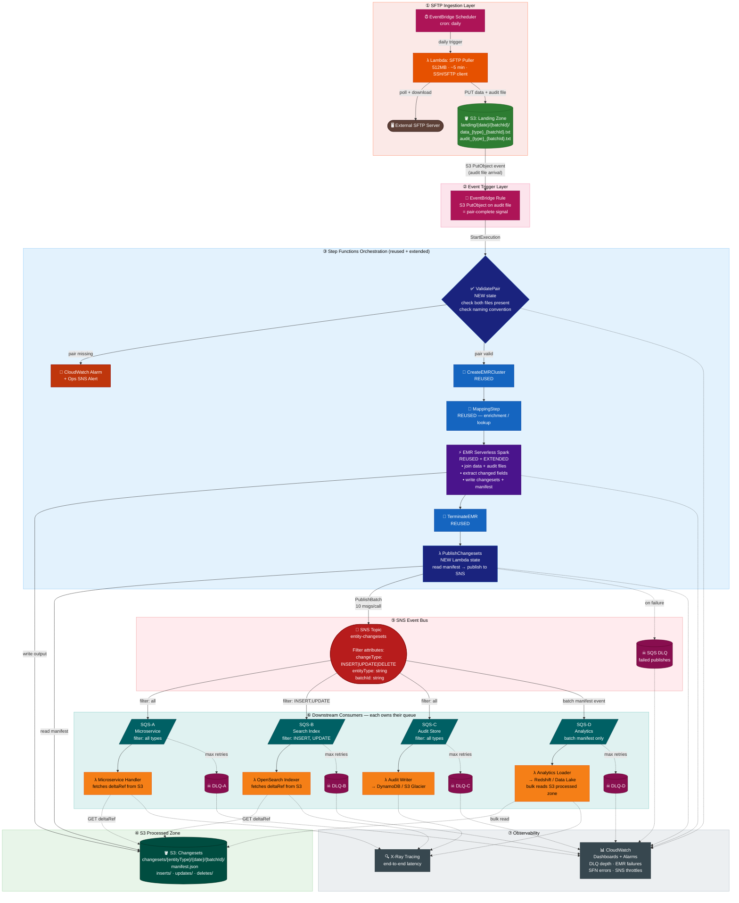

# Changeset Capture & Notification Architecture

---

## System Overview



### Colour Legend

| Colour | Node type |
|--------|-----------|
| 🟤 Brown | External / non-AWS system (SFTP server) |
| 🩷 Magenta | EventBridge (Scheduler + Rule) |
| 🟠 Orange | Lambda — ingestion side (SFTP Puller) |
| 🟢 Green | S3 Landing Zone |
| 🔵 Navy | Step Functions **NEW** states (ValidatePair, PublishChangesets) |
| 💙 Blue | Step Functions **REUSED** states (CreateEMR, MappingStep, TerminateEMR) |
| 🟣 Purple | EMR Serverless / Spark |
| 🌲 Dark green | S3 Processed Zone (changesets) |
| 🔴 Red | SNS Topic |
| 🟥 Maroon | Dead Letter Queues (all DLQs) |
| 🩵 Teal | SQS consumer queues |
| 🟡 Amber | Lambda — consumer side |
| 🩶 Grey-blue | Observability (CloudWatch, X-Ray) |
| 🔥 Burnt red | Alert / failure path |

---

## Why Each Service Was Chosen

### ① EventBridge Scheduler
**Why**: The SFTP server is external — no push mechanism exists. EventBridge Scheduler provides a fully managed, serverless cron that triggers the Lambda puller on a fixed daily schedule. Alternatives like CloudWatch Events work too, but EventBridge Scheduler has more flexible scheduling (rate, cron, one-time) and native error handling with retry policies.

**Why not EC2/ECS always-on**: Overkill for a once-daily pull. Lambda is stateless and costs nothing when idle.

---

### ② Lambda (SFTP Puller)
**Why**: A short-lived compute task that connects to an external SFTP over SSH, downloads two files (~300MB each), and uploads them to S3. Lambda handles this cleanly with a 15-minute max timeout (sufficient for 300MB at typical SFTP throughput). No persistent infrastructure needed.

**Why not DataSync**: AWS DataSync can sync SFTP → S3 but requires always-on DataSync agents for external SFTP servers. Lambda is simpler, cheaper, and directly controllable.

**Key config**: 512MB memory for buffer throughput; `/tmp` ephemeral storage for staging during transfer.

---

### ③ S3 (Landing Zone + Processed Zone)
**Why**: Object storage is the natural home for large flat files. EMR Spark reads natively from S3. S3 also acts as the **durable payload store** for downstream consumers (via S3 pointer pattern — critical given SNS's 256KB limit vs. 300MB files). S3 lifecycle policies handle automatic archival and expiry with zero operational effort.

**Why not EFS/EBS**: EMR on EC2 or Serverless already integrates with S3 as its distributed file system. EFS adds cost and complexity without benefit here.

---

### ④ EventBridge Rule (S3 → Step Functions trigger)
**Why**: The audit file's arrival in S3 is the signal that the batch is complete (both files are present). EventBridge S3 integration fires near-instantly on `s3:ObjectCreated` events and can start a Step Functions execution directly — no polling Lambda needed.

**Why the audit file specifically**: It's uploaded second (after the data file), making its arrival a reliable "pair complete" signal. The first Step Function state validates both are present.

---

### ⑤ AWS Step Functions (Orchestration)
**Why reuse**: Already in your stack. Step Functions provides visual execution tracing, built-in retry/catch, parallel state support, and native integrations with EMR and Lambda. The two new states (`ValidatePair`, `PublishChangesets`) slot in naturally at the start and end.

**Why not a single Lambda**: Orchestrating EMR cluster lifecycle (create → wait → run → wait → terminate) is complex to manage in Lambda. Step Functions handles the wait states and error paths elegantly.

**Type**: Standard workflow (not Express) — needed for EMR jobs that run > 5 minutes, and for exactly-once execution audit trails.

---

### ⑥ EMR Serverless (Spark Processing)
**Why reuse**: Spark is ideal for 300MB structured file joins (data file ⋈ audit file on entityId). Your team already has the pattern. EMR Serverless eliminates cluster management — no pre-warming, no idle costs. Auto-scales workers based on data volume.

**Why not Glue**: Glue is also Spark-based but has a higher minimum job duration billed (1 minute in DPU-hours). EMR Serverless is more cost-efficient for jobs that run 15–20 minutes with precise resource control. Your team's existing EMR pattern also avoids a migration.

**Why not Lambda alone**: Lambda's 15-minute timeout and 10GB `/tmp` limit would be tight for processing and joining two 300MB files. Spark's distributed in-memory processing is the right tool.

---

### ⑦ SNS (Event Bus / Fan-out)
**Why**: SNS is the canonical AWS pub/sub primitive. Its **message attribute filter policies** let each downstream consumer subscribe only to the change types and entity types they care about — with zero filtering logic on the publisher side. Scales to millions of messages per second.

**Why not EventBridge (event bus)**: EventBridge has richer routing rules and native schema registry, but costs ~5× more per event than SNS ($1.00/1M vs $0.50/1M) and adds latency. For high-volume entity events (100K+ per batch), SNS is more cost-effective. EventBridge is better suited for complex cross-service event routing where you need content-based routing on the event body — not needed here since change type and entity type are known upfront as message attributes.

**Why not Kinesis**: Kinesis is better for ordered, high-throughput streaming (e.g., 1M events/sec). For a daily batch of 100K events with fan-out to multiple consumers, SNS + SQS is simpler and cheaper.

---

### ⑧ SQS (Per-Consumer Queues)
**Why**: Each downstream consumer gets their own SQS queue. This means:
- **Independent failure isolation** — one consumer failing doesn't block others
- **Independent scaling** — each consumer scales its Lambda concurrency separately
- **Dead letter queues** — poison pill messages park in DLQ without blocking the queue
- **Visibility timeout** — consumer can take up to 12 hours to process a message before it becomes visible again (important for slow analytics loads)

**Why not consumers subscribing to SNS directly (HTTP)**: HTTP endpoints must be always-on and publicly accessible. SQS decouples the publisher from consumer availability. If a consumer is down, messages queue up and are processed when it recovers.

---

### ⑨ CloudWatch + X-Ray (Observability)
**Why CloudWatch**: Native to all AWS services used. Zero integration cost. DLQ depth alarms catch stuck consumers. EMR job failure alarms catch bad data. Step Function execution dashboards give end-to-end visibility.

**Why X-Ray**: Traces Lambda invocations end-to-end (SFTP pull → SNS publish → consumer processing), giving per-entity latency breakdowns useful for SLA reporting.

---

## Cost Estimation

> **Assumptions**: 1 run/day · 300MB input file · ~100,000 entity records · 4 downstream consumers · us-east-1 pricing (2025) · EMR Serverless (not EC2)

### Per-Run Cost Breakdown

| Service | Resource | Calculation | Cost/Run |
|---------|----------|-------------|----------|
| **EventBridge Scheduler** | 1 invocation/day | $1.00 / 1M invocations | ~$0.00 |
| **Lambda — SFTP Puller** | 512MB · 300 sec | 150 GB-sec × $0.0000166667 | **$0.003** |
| **Lambda — PublishChangesets** | 256MB · 180 sec | 45 GB-sec × $0.0000166667 | **$0.001** |
| **S3 — Storage** | ~600MB/run (30-day retention) | 9GB avg × $0.023/GB ÷ 30 | **$0.007** |
| **S3 — Requests (GET)** | 100K entities × 4 consumers | 400K × $0.0004/1K | **$0.160** |
| **S3 — Requests (PUT)** | ~50 EMR output files | 50 × $0.005/1K | ~$0.00 |
| **EventBridge Rule** | 1 event/run | $1.00 / 1M events | ~$0.00 |
| **Step Functions** | ~10 state transitions | 10 × $0.025/1K | ~$0.00 |
| **EMR Serverless** | 12 vCPU + 48GB · 20 min | vCPU: $0.21 + Mem: $0.09 | **$0.300** |
| **SNS — Publish** | 100K messages | 100K × $0.50/1M | **$0.050** |
| **SNS — SQS Delivery** | 100K × 4 consumers | 400K × $0.50/1M | **$0.200** |
| **SQS** | 400K msgs × 3 ops each | 1.2M × $0.40/1M | **$0.080** |
| **CloudWatch Logs** | ~50MB logs/run | 0.05GB × $0.50/GB | **$0.025** |
| **Data Transfer** | Intra-region (S3→Lambda→SNS) | Minimal, mostly free tier | ~$0.005 |
| | | | |
| **TOTAL / RUN** | | | **≈ $0.83** |
| **TOTAL / MONTH** (30 runs) | | | **≈ $25** |

---

### Cost Breakdown by Layer (per run)

```
EMR Serverless     ████████████████████████████████  $0.30  (36%)
S3 GET Requests    ████████████████████             $0.16  (19%)
SNS Delivery       ████████████████████             $0.20  (24%)
SNS Publish        ████                             $0.05  ( 6%)
SQS                ████                             $0.08  ( 9%)
CloudWatch         ██                               $0.025 ( 3%)
Lambda             █                                $0.004 (<1%)
All others         <                                ~$0.01 (<1%)
                                                    ──────
                                                    ~$0.83
```

---

### Cost Sensitivity: What Changes the Bill

| Scenario | Impact | Adjusted Cost/Run |
|----------|--------|-------------------|
| 500K entities (vs 100K) | SNS × 5, SQS × 5, S3 GET × 5 | ~$2.40 |
| 10K entities (vs 100K) | SNS + SQS drop by 90% | ~$0.56 |
| 8 consumers (vs 4) | SNS delivery + SQS doubles | ~$1.11 |
| EMR on EC2 (3× m5.xlarge, 30 min) | +$0.07 vs Serverless | ~$0.90 |
| S3 Intelligent-Tiering (retention > 30 days) | Reduces storage cost | saves ~$0.03/run |
| Consumers in different AWS account | Cross-account SNS/SQS no extra cost | no change |

---

### Cost Optimization Tips

1. **Use EMR Serverless** (not EC2) — no idle cluster cost; billed per actual vCPU-second
2. **Batch SNS publishes** — use `PublishBatch` (10 msgs/call) to reduce API call overhead
3. **S3 Lifecycle** — expire raw landing files after 7 days, changesets after 30 days → saves storage
4. **SQS long polling** — set `ReceiveMessageWaitTimeSeconds=20` on consumer queues → reduces empty receive cost
5. **Compress changeset files** — gzip JSON in S3 reduces storage and GET transfer costs by ~70%

---

## Input File Formats

### Data File (`data_{changeType}_{batchId}.txt`)
One JSON object per line. Contains **only changed field values** for UPDATE;
full record for INSERT; entity ID only for DELETE.

```jsonl
{"entityId":"ENT-001","firstName":"Jane","email":"jane@new.com"}
{"entityId":"ENT-002","status":"ACTIVE","tier":"GOLD"}
{"entityId":"ENT-003","phone":"+15550001234"}
```

### Audit File (`audit_{changeType}_{batchId}.txt`)
One JSON object per line. Full row with `1` (changed) / `0` (unchanged).

```jsonl
{"entityId":"ENT-001","firstName":1,"lastName":0,"email":1,"phone":0,"status":0,"tier":0,"address":0}
{"entityId":"ENT-002","firstName":0,"lastName":0,"email":0,"phone":0,"status":1,"tier":1,"address":0}
{"entityId":"ENT-003","firstName":0,"lastName":0,"email":0,"phone":1,"status":0,"tier":0,"address":0}
```

### File Naming Convention
```
data_{INSERT|UPDATE|DELETE}_{batchId}_{YYYYMMDD}.txt
audit_{INSERT|UPDATE|DELETE}_{batchId}_{YYYYMMDD}.txt
```

---

## EMR Spark Job: Changeset Processing Logic

```
1. Read data file  (JSON lines)    → dataDF
2. Read audit file (JSON lines)    → auditDF
3. JOIN dataDF + auditDF ON entityId
4. For each row:
   - changedFields = [col for col in auditDF if value == 1]
   - deltaPayload  = {col: dataDF[col] for col in changedFields}
   - fullAuditRow  = auditDF row
5. Write per changeType partition to S3 processed zone (JSON or Parquet)
6. Write manifest.json:
   - batchId, entityType, changeType counts, S3 paths, record counts
```

---

## SNS Event Contract

### SNS Message Attributes (for filter policies)

| Attribute     | Type   | Values                       | Description                          |
|--------------|--------|------------------------------|--------------------------------------|
| changeType   | String | `INSERT`, `UPDATE`, `DELETE` | Type of change                       |
| entityType   | String | e.g. `Customer`, `Order`     | Domain entity type                   |
| batchId      | String | UUID                         | Groups all events from one file drop |
| eventVersion | String | `1.0`                        | Schema version for evolution         |

---

### SNS Payload Schema — Recommended: Metadata + S3 Pointer

> SNS has a 256KB message limit. With 100K+ entities in a 300MB file, embedding payloads
> is not viable. S3 pointer keeps each message ~1KB, minimises SNS cost, and lets consumers
> fetch only what they need on demand.

```json
{
  "eventId": "uuid-v4",
  "eventVersion": "1.0",
  "eventType": "ENTITY_CHANGESET",
  "changeType": "UPDATE",
  "entityType": "Customer",
  "entityId": "ENT-001",
  "batchId": "batch-20240315-abc123",
  "occurredAt": "2024-03-15T10:32:00Z",
  "processedAt": "2024-03-15T10:45:22Z",

  "changeset": {
    "changedFields": ["firstName", "email"],
    "deltaRef": "s3://bucket/changesets/Customer/2024-03-15/batch-abc123/updates/ENT-001_delta.json",
    "fullAuditRef": "s3://bucket/changesets/Customer/2024-03-15/batch-abc123/updates/ENT-001_audit.json"
  },

  "source": {
    "dataFile": "s3://bucket/landing/2024-03-15/batch-abc123/data_UPDATE_batch-abc123_20240315.txt",
    "auditFile": "s3://bucket/landing/2024-03-15/batch-abc123/audit_UPDATE_batch-abc123_20240315.txt"
  },

  "processing": {
    "emrJobId": "j-XXXXXXXXXX",
    "stepFunctionExecutionId": "arn:aws:states:..."
  }
}
```

---

### Payload Options Comparison

| Option | Description | Msg Size | Cost/Run | Latency | Best For |
|--------|-------------|----------|----------|---------|----------|
| **A — Recommended** | Metadata + S3 pointer | ~1KB | Low | Fetch on demand | All consumers; safe default |
| **B** | Inline delta (changed fields only) | Up to 256KB | Medium | Instant | Small entities, microservices needing zero-fetch latency |
| **C** | Batch manifest only | 1 msg/batch | Lowest | Batch consumers wait | Analytics / data warehouse bulk loads |

**Recommended hybrid: A + C**
- Option A per-entity events → real-time consumers (microservices, search, audit)
- Option C batch manifest → analytics/warehouse consumers that process the full file

---

## Step Function Extension

```
[EXISTING STATES]                    [NEW / EXTENDED]
─────────────────────────────────    ──────────────────────────────────────────
                                     ValidatePair                          ← NEW
                                       check data + audit both present
                                       check naming convention
                                       check file size within bounds
                                       ↓ FAIL → CloudWatch Alarm + Ops Alert
CreateEMRCluster                     ← REUSED
OptionalMappingStep                  ← REUSED (enrichment / lookups)
SparkProcessingStep                  ← EXTENDED
                                       existing: transforms + mappings
                                       new:  join data file + audit file
                                       new:  extract changed fields
                                       new:  write changesets to S3
                                       new:  write manifest.json
TerminateEMRCluster                  ← REUSED
                                     PublishChangesets (Lambda)            ← NEW
                                       read manifest.json
                                       PublishBatch to SNS (10 msgs/call)
                                       emit batch-complete event
End
```

---

## S3 Directory Structure

```
s3://your-bucket/
├── landing/
│   └── {YYYY-MM-DD}/
│       └── {batchId}/
│           ├── data_{INSERT|UPDATE|DELETE}_{batchId}_{date}.txt
│           └── audit_{INSERT|UPDATE|DELETE}_{batchId}_{date}.txt
│
├── changesets/
│   └── {entityType}/
│       └── {YYYY-MM-DD}/
│           └── {batchId}/
│               ├── manifest.json
│               ├── inserts/   {entityId}_delta.json
│               ├── updates/   {entityId}_delta.json · {entityId}_audit.json
│               └── deletes/   {entityId}_delta.json
│
└── archive/
    └── {YYYY-MM-DD}/
        └── {batchId}/          ← raw files moved here post-processing (7-day expiry)
```

---

## Manifest File Schema

```json
{
  "batchId": "batch-20240315-abc123",
  "entityType": "Customer",
  "changeType": "UPDATE",
  "processedAt": "2024-03-15T10:45:22Z",
  "sourceDataFile": "s3://...",
  "sourceAuditFile": "s3://...",
  "stats": {
    "totalRecords": 12450,
    "inserts": 200,
    "updates": 12100,
    "deletes": 150
  },
  "paths": {
    "inserts": "s3://bucket/changesets/Customer/2024-03-15/batch-abc123/inserts/",
    "updates": "s3://bucket/changesets/Customer/2024-03-15/batch-abc123/updates/",
    "deletes": "s3://bucket/changesets/Customer/2024-03-15/batch-abc123/deletes/"
  },
  "emrJobId": "j-XXXXXXXXXX"
}
```

---

## Consumer Onboarding Guide

### How to Subscribe
1. Create an SQS queue in your account with a DLQ attached
2. Request subscription to SNS topic `arn:aws:sns:region:account:entity-changesets`
3. Set a filter policy (optional) — example:

```json
{
  "changeType": ["UPDATE", "INSERT"],
  "entityType": ["Customer"]
}
```

### How to Process an Event
1. Receive SQS message → parse SNS envelope → extract event body
2. Check `changeType` for routing logic
3. Idempotency check: store + check `eventId` to handle redeliveries
4. Fetch from S3 if needed:
   - Changed fields only → `changeset.deltaRef`
   - Audit flags (which fields changed) → `changeset.fullAuditRef`
5. Process and delete from SQS

### Delivery Guarantees
| Guarantee | Detail |
|-----------|--------|
| Delivery | At-least-once (SQS standard) |
| Ordering | Not guaranteed across entities; use `batchId` + `entityId` for within-batch ordering |
| Replay | Raw files in `archive/` for 7 days; changesets in `changesets/` for 30 days |
| Schema evolution | `eventVersion` bumped on breaking changes; consumers should tolerate unknown fields |

---

## Infrastructure Summary

| Component | Service | Role |
|-----------|---------|------|
| SFTP polling | EventBridge Scheduler + Lambda | Daily cron pull from external SFTP |
| Landing zone | S3 | Raw file staging before processing |
| Pair trigger | EventBridge S3 Rule | Audit file arrival = batch ready signal |
| Orchestration | Step Functions (Standard) | EMR lifecycle + error handling + tracing |
| Processing | EMR Serverless (Spark) | Changeset join, extract, partition write |
| Changeset store | S3 | Durable payload store; consumed via S3 pointer |
| Event bus | SNS | Fan-out with attribute-based filter policies |
| Consumer queues | SQS (per consumer) + DLQ | Reliable delivery; failure isolation |
| Observability | CloudWatch + X-Ray | Alarms, dashboards, end-to-end traces |
